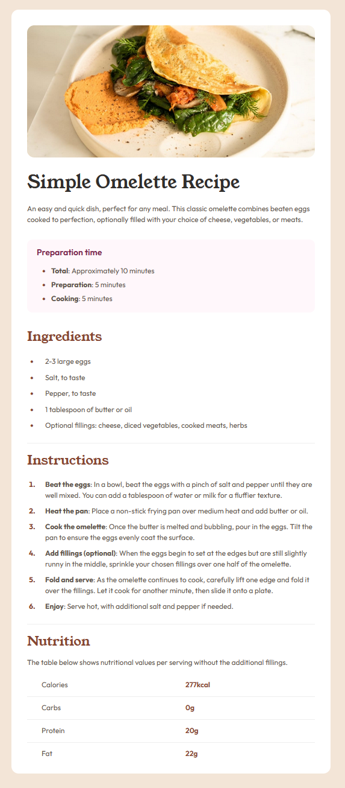
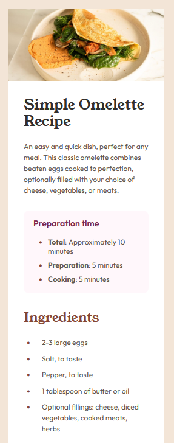
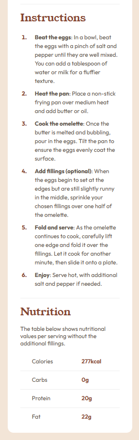

# Frontend Mentor - Recipe page solution

This is a solution to the [Recipe page challenge on Frontend Mentor](https://www.frontendmentor.io/challenges/recipe-page-KiTsR8QQKm). Frontend Mentor challenges help you improve your coding skills by building realistic projects.

## Table of contents

- [Overview](#overview)
  - [The challenge](#the-challenge)
  - [Screenshot](#screenshot)
  - [Links](#links)
- [My process](#my-process)
  - [Built with](#built-with)
- [Author](#author)

## Overview

### Screenshot

Mobile:

### Links

- [Solution URL](https://github.com/bsd-rgb/Recipe-Page)
- [Live Site URL](https://bsd-rgb.github.io/Recipe-Page/)

## My process

### Built with

- HTML
- CSS -> Flexbox, Grid

## Author

- Frontend Mentor - [@bsd-rgb](https://www.frontendmentor.io/profile/bsd-rgb)
